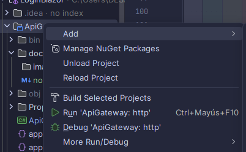

# Pasos tomados

la configuracion fue basada en https://github.com/abd123al/aspnetrun-microservices-dotnet-good/tree/master/src/WebApps/AspnetRunBasics

Las rutas fueron configuradas para los ambientes locales dev y produccion utilizando la ayuda de github copilot, referenciando la api y las rutas fue solicitado la creacion de las rutas.

Based on the Login Service, you can add the following routes to your Ocelot API Gateway configuration.

```json
"Routes": [
        {
            "DownstreamPathTemplate": "/auth/login",
            "DownstreamScheme": "http",
            "DownstreamHostAndPorts": [
                {
                    "Host": "localhost",
                    "Port": "5001"
                }
            ],
            "UpstreamPathTemplate": "/api/v1/Security/auth/login",
            "UpstreamHttpMethod": [ "POST" ]
        },
        {
            "DownstreamPathTemplate": "/users",
            "DownstreamScheme": "http",
            "DownstreamHostAndPorts": [
                {
                    "Host": "localhost",
                    "Port": "5001"
                }
            ],
            "UpstreamPathTemplate": "/api/v1/Security/users",
            "UpstreamHttpMethod": [ "GET", "POST" ]
        },
        {
            "DownstreamPathTemplate": "/users/{userId}",
            "DownstreamScheme": "http",
            "DownstreamHostAndPorts": [
                {
                    "Host": "localhost",
                    "Port": "5001"
                }
            ],
            "UpstreamPathTemplate": "/api/v1/Security/users/{userId}",
            "UpstreamHttpMethod": [ "GET", "PUT", "DELETE" ]
        },
        {
            "DownstreamPathTemplate": "/roles",
            "DownstreamScheme": "http",
            "DownstreamHostAndPorts": [
                {
                    "Host": "localhost",
                    "Port": "5001"
                }
            ],
            "UpstreamPathTemplate": "/api/v1/Security/roles",
            "UpstreamHttpMethod": [ "GET", "POST" ]
        },
        {
            "DownstreamPathTemplate": "/roles/{roleId}",
            "DownstreamScheme": "http",
            "DownstreamHostAndPorts": [
                {
                    "Host": "localhost",
                    "Port": "5001"
                }
            ],
            "UpstreamPathTemplate": "/api/v1/Security/roles/{roleId}",
            "UpstreamHttpMethod": [ "GET", "PUT", "DELETE" ]
        },
        {
            "DownstreamPathTemplate": "/users/{userId}/roles",
            "DownstreamScheme": "http",
            "DownstreamHostAndPorts": [
                {
                    "Host": "localhost",
                    "Port": "5001"
                }
            ],
            "UpstreamPathTemplate": "/api/v1/Security/users/{userId}/roles",
            "UpstreamHttpMethod": [ "GET", "POST" ]
        },
        {
            "DownstreamPathTemplate": "/users/{userId}/roles/{roleId}",
            "DownstreamScheme": "http",
            "DownstreamHostAndPorts": [
                {
                    "Host": "localhost",
                    "Port": "5001"
                }
            ],
            "UpstreamPathTemplate": "/api/v1/Security/users/{userId}/roles",
            "UpstreamHttpMethod": [ "DELETE" ]
        },
        {
            "DownstreamPathTemplate": "/roles/{roleId}/pantallas",
            "DownstreamScheme": "http",
            "DownstreamHostAndPorts": [
                {
                    "Host": "localhost",
                    "Port": "5001"
                }
            ],
            "UpstreamPathTemplate": "/api/v1/Security/roles/{roleId}/pantallas",
            "UpstreamHttpMethod": [ "POST" ]
        }
        
  ]
```
Uso, correr com en la figura .

Si funciona bien debe de aparecer la siguiente figura .

Si tanto los servicios como gateway esta corriendo puede ser probado en postman, .
